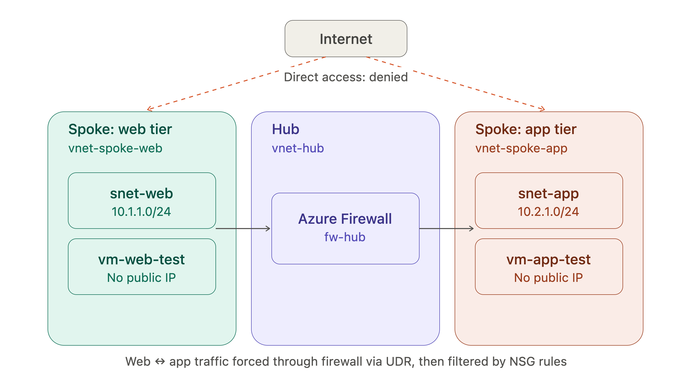

# azure-hub-spoke-network-lab

# Overview

This project implements a network segmentation architecture that mirrors how enterprise networks are commonly designed: a central "hub" network containing shared security infrastructure (a firewall), connected to a isolated "spoke" networks representing different application tiers (web and app). Rather than letting the spokes communicate directly, all inter-spoke traffic is forced through the hub's firewall for inspection, and each subnet carries its own network security group as a second layer of access control.

# Why Hub-and-Spoke?

In a flat network, every Virtual Machine can talk to every other Virtual Machine by default. That is fine for a small lab, but it does not reflect how real organizations operate, and it fails the "least privilege" principle that security teams are graded on. A compromised web server in a flat network could pivot straight to a database server with zero friction.

Hub-and-spoke solves this by centralizing the choke point. Instead of trusting each spoke to defend itself, all cross-spoke traffic is forced through one inspection point (the firewall) that can log, allow, or deny traffic based on explicit rules. This also mirrors how real enterprises structure Azure environments: a shared hub VNet holds common services (firewall, VPN gateway, DNS), while spokes hold workload-specific resources.

# Architecture

## IP address planning

**vnet-hub** -- 10.0.0.0/16 -- AzureFirewallSubnet(10.0.0.0/26) -- Hosts Azure Firewall

**vnet-spoke-web** -- 10.1.0.0/16 -- snet-web(10.1.1.0/24) -- Web tier

**vnet-spoke-app** -- 10.2.0.0/16 -- snet-app(10.2.1.0/24) -- App tier

**All resources were grouped under a single resource group (hubspoke-lab) in East US**

# Build Steps

## 1. Resource group

Created hubspoke-lab to contain everything, keeping the project organized and easy to tear down as a single unit later.

## 2. VNets

Deployed all three VNets (hub,spoke-web,spoke-app) in the same region with non-overlapping address spaces, a prerequisite for peering to work cleanly.

## 3. VNet peering

Peered each spoke to the hub (not to eachother, that is the core design principle: spokes never talk directly). For each peering: - Enabled "allow forwarded traffic" on the spoke side, which is what allows traffic that is been redirected by the firewall to actually reach its destination instead of being silently dropped - Confirmed both peerings showed "Fully Synchronized" and "Connected" status before moving on

## 4. Azure Firewall Deployment

Deployed a Standard SKU Azure Firewall (fw-hub) into the hub's AzureFirewallSubnet, with its own dedicated public IP (10.0.0.4). This became the mandatory inspection point for cross-spoke traffic.

## 5. Route Tables (UDR)

This step enforces the "traffic must go through the firewall" behavior, peering alone would let spokes talk directly. CReated rt-spoke-to-firewall with a single route: - Destination: 10.0.0.0/8 (covers all three VNets) - Next hop type: Virtual appliance - Next hop address: the firewall's private IP

Associated this route table with both snet-web and snet-app, so any traffic leaving either spoke toward the shared address space now routes through the firewall instead of taking the direct peered path.

## 6. Firewall rules

By default, Azure Firewall denies everything passing through it, which is the correct deafuly-deny starrting point: Added one explicit network rule connection (allow-web-to-app, priority 100, action Allow): - Source: 10.1.1.0/24 (web subnet) - Destination: 10.2.1.0/24 (app subnet) - Protocol: TCP, port 80
Everything else passing through the firewall remains denied by dafault.

## 7. Network Security Groups

Added a second, independent layer of access control directly on the subnets: - nsg-web associated with snet-web - nsg-app associated with snet-app, with an explicit inbound rule (allow-Web-To-App-HTTP) permitting only 10.1.1.0/24 on port 80, everything else caught by Azure's defauly DenyAllInBound rule

This defense-in-depth approach means even if the firewall or routing were ever misconfigured, the NSGs independently enforce the same intent.

## 8. Test VMs

Deployed two Ubuntu 24.04 VMs (vm-web-test, vm-app-test), one in each spoke subnet, deliberately with no pubic IP addresses. This was intentional: proving the internet cannot reach either VM directly is part of the point of the architecture, not an oversight.

## 9. Proving segmentation works

Rather than logging into the VMs, connectivity was validated using Azure Netowk Watcher's IP Flow Verify tool, which evaluates a given traffic pattern (source/destination IP, port, protocol) against the actual NSG and routing configuration in place.

### Test 1 -- Web -> App on port 80:

Result: Access allowed, via rule Allow-Web-To-App-HTTP on nsg-app

This confirms the explicit rule written for this project is what's permitting the intended traffic

### Test 2 -- Internet -> App VM:

Simulated traffic from a public IP (8.8.8.8) toward the app VM
Result: Access Denied, via rule DenyAllInBound

This confirms that without an explicit allow rule, nothing external can reach the app tier directly, exactly the segmentation goal.

## 10. Log Analytics + firewall diagnostics

Created a Log Analytics workspace (law-hubspoke) and configured diagnostic settings on the firewall to send Network Rule and Application Rule logs to it, enabling KQL-based querying of firewall decisions:
\*\* Note on results: This query returned zero rows during testing. Network Watchers IP Flow Verify evaluates rule logic without generating real TCP traffic through the firewalls data plane, so no firewall-level log entries were produced. The diagnostic pipeline itself was confirmed functional(the query executed successfully against the correct table with no errors), it simply had nothing to log yet. In a production scenario or with real inter-VM traffic generated over time, this same query would surface live allow/deny decisions as they occur.

# Glossary

**VNet (Virtual Network)** - Azure's version of a private network. It's an isolated address space where you place resources like VMs, and it controls what can talk to what

**Subnet** - A smaller slice of a VNet's address range. VNets get divided into subnets so different resources (web servers, databases, firewalls) can be grouped and controlled seperately

**Hub-and-Spoke** - A netowrk design pattern where one central network (the hub) holds shared resources, and multiple other networks (spokes) connect to it, but not to each other directly

**Peering** - The Azure feature that connects to VNets together so resources in each can communicate, as if they were on the same network. Peering must be configured on both sides of the connection

**Azure Firewall** - A managed, cloud-based firewall service, It inspects traffic passing through it and applies rules to allow or deny that traffic based on source, destination, port, and protocol

**NSG (Network Security Group)** - A set of allow/deny rules attached directly to a subnet or network interface.

**UDR (User Defined Route) / Route table** - A custom rule that overrides Azure;s default routing behavior, telling traffic to take a specific path instead of the direct route it would normally take

**Private IP** - An IP address only reachable from within a private network, not from the public internet

**Public IP** — An IP address reachable from the internet. The test VMs in this project deliberately have none, since proving they can't be reached externally was part of the goal.

**Network Watcher** — An Azure diagnostic tool used to test and troubleshoot network behavior, in this project, its "IP Flow Verify" feature was used to simulate traffic and confirm whether it would be allowed or denied.

**Log Analytics workspace** — A centralized place where Azure resources send logs so they can be searched and analyzed, in this case, using KQL.

**KQL (Kusto Query Language)** — The query language used to search and filter log data in Azure Log Analytics and Microsoft Sentinel.
